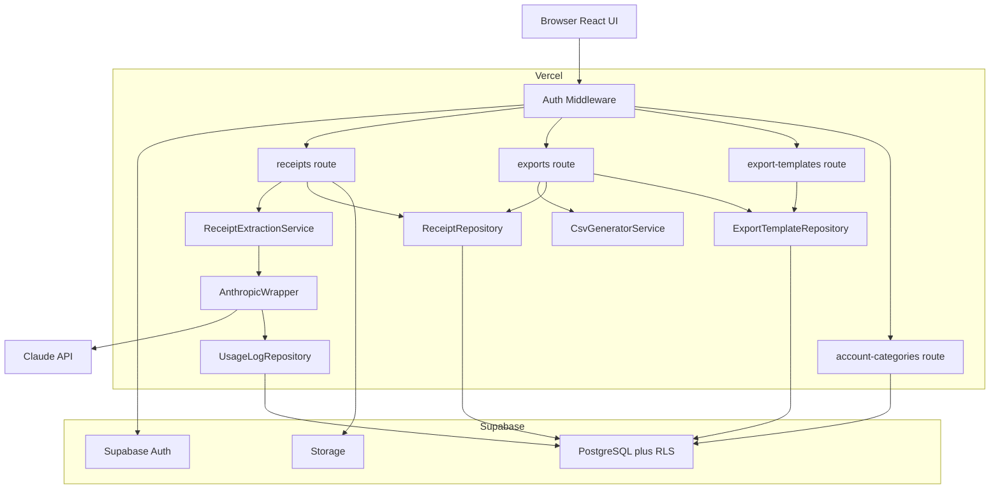
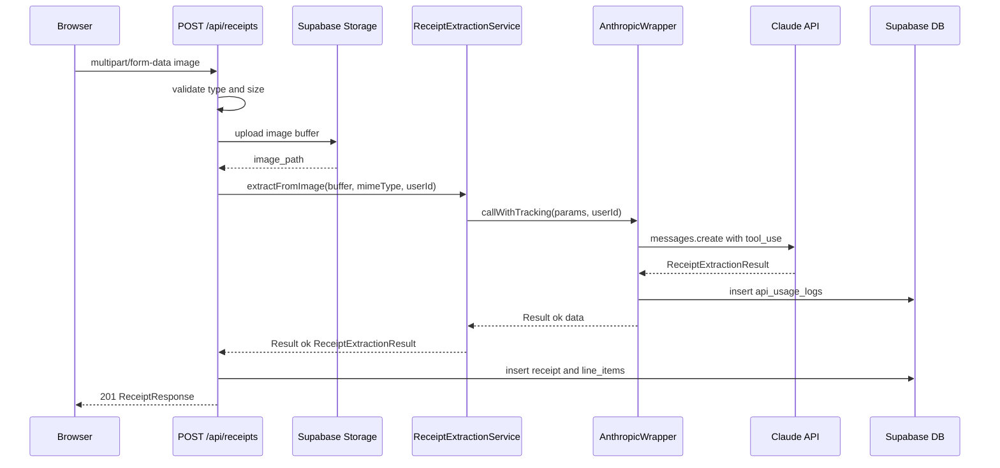
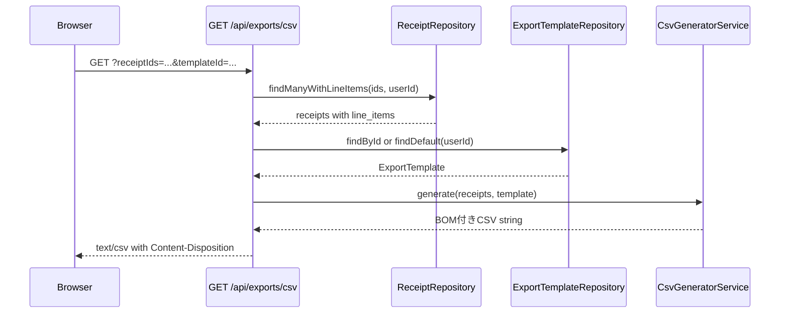

# 設計書: receipt-csv-mvp

## 概要

**目的**: slipifyのMVPとして、ユーザーがレシート画像をアップロードしてClaude APIで自動解析し、構造化データをSupabase DBに保存・CSVエクスポートできるWebアプリケーションを提供する。AI予測による勘定科目付与と将来のサブスク課金に備えたAPI使用量トラッキングを含む。

**ユーザー**: 個人・小規模事業者が経費精算・確定申告業務に活用する。

**影響**: グリーンフィールド。Next.js 15 + Supabase + Claude APIによる新規フルスタックWebアプリの初期構築。

### ゴール

- レシート画像から構造化データへの自動変換（手入力ゼロ）
- AI予測による勘定科目付与で経費精算・確定申告を効率化
- カスタマイズ可能なCSVエクスポートで既存業務フローへの統合
- API使用量トラッキングによる将来の課金モデル基盤構築

### 非ゴール

- フェーズ2機能（Excel/JSON/PDF出力、レシート以外の紙媒体、検索・集計）
- 実際の課金処理（使用量の記録のみ）
- 管理者ダッシュボード・ユーザー管理画面
- オフライン対応・PWA

---

## 要件トレーサビリティ

| 要件 | サマリ | コンポーネント | インターフェース | フロー |
|------|--------|----------------|------------------|--------|
| 1.1–1.5 | ユーザー認証 | AuthMiddleware | Supabase Auth | 認証フロー |
| 2.1–2.5 | 画像アップロード・バリデーション | ReceiptUploadHandler | POST /api/receipts | アップロード・解析フロー |
| 3.1–3.6 | AI解析・データ抽出 | ReceiptExtractionService, AnthropicWrapper | ReceiptExtractionService | アップロード・解析フロー |
| 4.1–4.5 | レシートデータ管理 | ReceiptCrudHandler, ReceiptRepository | GET/DELETE/PATCH /api/receipts/[id] | — |
| 5.1–5.5 | CSVエクスポート | ExportCsvHandler, CsvGeneratorService | GET /api/exports/csv | CSVエクスポートフロー |
| 6.1–6.5 | CSVフォーマットカスタマイズ | ExportTemplateHandler, ExportTemplateRepository | GET/POST/PUT/DELETE /api/export-templates | — |
| 7.1–7.3 | 使用量トラッキング | AnthropicWrapper, UsageLogRepository | api_usage_logs | アップロード・解析フロー |
| 8.1–8.5 | 勘定科目予測・管理 | ReceiptExtractionService, AccountCategoryHandler | PATCH /api/receipts/[id], GET/POST /api/account-categories | — |

---

## アーキテクチャ

### アーキテクチャパターン・境界マップ

Next.js App RouterのモノリシックフルスタックパターンをVercel上で採用。Route HandlerがREST APIとして機能し、別途バックエンドサービスは不要（`research.md` のパターン比較を参照）。



**境界の原則**:

- `lib/anthropic/` のみがClaude APIと通信し、`ANTHROPIC_API_KEY` を管理する
- 使用量ログ書き込みは `AnthropicWrapper` が一元管理し、呼び出し元は意識しない
- 全テーブルにRLSを適用し、`user_id = auth.uid()` によりデータ分離を保証する
- UIコンポーネントはビジネスロジックを持たない

### 技術スタック

| 層 | 技術 / バージョン | 役割 |
| --- | --- | --- |
| フロントエンド | Next.js 15（App Router）+ React | ページ・UI |
| スタイリング | Tailwind CSS | UIスタイリング |
| バックエンドAPI | Next.js Route Handlers（Vercelサーバーレス） | REST API |
| 認証 | @supabase/ssr + Supabase Auth | セッション管理・認証 |
| データベース | Supabase（PostgreSQL） | データ永続化 |
| ファイルストレージ | Supabase Storage | レシート画像保存 |
| AI処理 | @anthropic-ai/sdk + claude-sonnet-4-6 | レシート解析・勘定科目予測 |
| 言語 | TypeScript strict | 型安全性 |
| インフラ | Vercel | ホスティング |

**モデル選定**: `claude-sonnet-4-6`（精度とコストのバランス）。複雑なレシートで精度不足が判明した場合は `claude-opus-4-6` へ切り替え可能（`research.md` 参照）。

---

## システムフロー

### アップロード・解析フロー



**設計判断**: 画像バッファはStorage保存とClaude API呼び出しで同一のものを使用（再ダウンロード不要）。`api_usage_logs` 書き込み失敗は解析フローを中断しない（7.3）。全処理はRoute Handler内で同期実行（Vercel Hobby 30秒制限内を前提）。

### CSVエクスポートフロー



---

## コンポーネントとインターフェース

### サマリテーブル

| コンポーネント | 層 | 役割 | 要件 | 主要依存 | コントラクト |
| --- | --- | --- | --- | --- | --- |
| AuthMiddleware | インフラ | 認証チェック・セッション更新 | 1.1–1.5 | Supabase Auth (P0) | — |
| ReceiptUploadHandler | API | アップロード受付・AI解析起動 | 2.1–2.5, 3.1 | ExtractionSvc (P0), Storage (P0) | API |
| ReceiptCrudHandler | API | 一覧・詳細・削除・勘定科目更新 | 4.1–4.5, 8.3 | ReceiptRepository (P0) | API |
| ExportCsvHandler | API | CSVファイル生成・配信 | 5.1–5.5 | CsvGeneratorService (P0), ReceiptRepository (P0) | API |
| ExportTemplateHandler | API | テンプレートCRUD | 6.1–6.5 | ExportTemplateRepository (P0) | API |
| AccountCategoryHandler | API | カスタム勘定科目管理 | 8.1, 8.2, 8.4 | Supabase DB (P0) | API |
| ReceiptExtractionService | ビジネスロジック | Claude API呼び出し・レスポンスパース | 3.2–3.5, 8.2 | AnthropicWrapper (P0) | Service |
| AnthropicWrapper | ビジネスロジック | Claude APIラッパー・使用量ログ | 7.1–7.3 | Claude API (P0), UsageLogRepository (P1) | Service |
| CsvGeneratorService | ビジネスロジック | テンプレートに基づくCSV生成 | 5.2–5.5, 6.4 | — | Service |
| ReceiptRepository | データアクセス | receipts + line_items CRUD | 4.1–4.5 | Supabase DB (P0) | Service |
| ExportTemplateRepository | データアクセス | export_templates CRUD | 6.1–6.5 | Supabase DB (P0) | Service |
| UsageLogRepository | データアクセス | api_usage_logs 書き込み | 7.1–7.2 | Supabase DB (P0) | Service |

---

### インフラ層

#### AuthMiddleware

| フィールド | 詳細 |
|-----------|------|
| Intent | すべてのリクエストのセッション検証とcookieリフレッシュを行う |
| 要件 | 1.1, 1.2, 1.4, 1.5 |

**責務と制約**

- `@supabase/ssr` の `createServerClient` を使用し `supabase.auth.getUser()` でセッション検証（`getSession()` は不使用）
- 未認証状態でのページアクセスは `/login` へリダイレクト
- 未認証状態でのAPI呼び出しは401を返す

**実装メモ**

- パスマッチャーで `/login`・`/signup` はスキップ
- Cookie は `getAll()` / `setAll()` インターフェースで操作

---

### API層

#### ReceiptUploadHandler（POST /api/receipts）

| フィールド | 詳細 |
|-----------|------|
| Intent | レシート画像の受付・バリデーション・AI解析起動・レコード生成を一連で処理する |
| 要件 | 2.1–2.5, 3.1–3.6, 7.1 |

**コントラクト**: API [x]

| Method | Endpoint | Request | Response | Errors |
|--------|----------|---------|----------|--------|
| POST | /api/receipts | multipart/form-data `file: File` | 201 `ReceiptResponse` | 400, 422, 504, 500 |

```typescript
interface ReceiptResponse {
  receipt: Receipt & { lineItems: LineItem[] }
}

type UploadError =
  | { code: 'INVALID_FILE_TYPE'; message: string }
  | { code: 'FILE_TOO_LARGE'; message: string }
  | { code: 'UNREADABLE_IMAGE'; message: string }
  | { code: 'EXTRACTION_FAILED'; message: string }
  | { code: 'INTERNAL_ERROR'; message: string }
```

**実装メモ**

- MIME typeで `image/jpeg`, `image/png`, `image/webp` のみ許可
- サイズ上限: 10MB（10 × 1024 × 1024バイト）
- Storageパス: `receipts/{userId}/{uuid}.{ext}`
- `file.arrayBuffer()` で取得したバッファをStorage保存とClaude APIの両方に使用

#### ReceiptCrudHandler

| フィールド | 詳細 |
|-----------|------|
| Intent | レシートの一覧・詳細・削除・勘定科目更新を提供する |
| 要件 | 4.1–4.5, 8.3, 8.5 |

**コントラクト**: API [x]

| Method | Endpoint | Request | Response | Errors |
|--------|----------|---------|----------|--------|
| GET | /api/receipts | — | 200 `ReceiptListResponse` | 401 |
| GET | /api/receipts/[id] | — | 200 `ReceiptResponse` | 401, 404 |
| DELETE | /api/receipts/[id] | — | 204 | 401, 404 |
| PATCH | /api/receipts/[id] | `{ accountCategory: string }` | 200 `{ receipt: Receipt }` | 400, 401, 404 |

```typescript
interface ReceiptListResponse {
  receipts: Receipt[]
  total: number
  totalAmount: number
}
```

#### ExportCsvHandler（GET /api/exports/csv）

| フィールド | 詳細 |
|-----------|------|
| Intent | 選択されたレシートをテンプレートに従いCSVファイルとして配信する |
| 要件 | 5.1–5.5, 6.4 |

**コントラクト**: API [x]

| Method | Endpoint | Request | Response | Errors |
|--------|----------|---------|----------|--------|
| GET | /api/exports/csv | query: `receiptIds`, `templateId?` | 200 `text/csv` | 400, 401 |

- `receiptIds`: カンマ区切りのUUID文字列（必須）
- `templateId`: 省略時はデフォルトテンプレートまたは組み込みデフォルトを使用
- レスポンスヘッダ: `Content-Disposition: attachment; filename="slipify_receipts_YYYYMMDD.csv"`、`Content-Type: text/csv; charset=utf-8`

#### ExportTemplateHandler

| フィールド | 詳細 |
|-----------|------|
| Intent | CSVエクスポートテンプレートのCRUDを提供する |
| 要件 | 6.1–6.5 |

**コントラクト**: API [x]

| Method | Endpoint | Request | Response | Errors |
|--------|----------|---------|----------|--------|
| GET | /api/export-templates | — | 200 `{ templates: ExportTemplate[] }` | 401 |
| POST | /api/export-templates | `CreateTemplateRequest` | 201 `{ template: ExportTemplate }` | 400, 401 |
| PUT | /api/export-templates/[id] | `UpdateTemplateRequest` | 200 `{ template: ExportTemplate }` | 400, 401, 404 |
| DELETE | /api/export-templates/[id] | — | 204 | 401, 404 |

```typescript
interface CreateTemplateRequest {
  name: string
  columns: ExportColumn[]
  delimiter: Delimiter
  isDefault?: boolean
}

type UpdateTemplateRequest = Partial<CreateTemplateRequest>
```

#### AccountCategoryHandler

| フィールド | 詳細 |
|-----------|------|
| Intent | 固定勘定科目リストの取得とカスタム勘定科目のCRUDを提供する |
| 要件 | 8.1, 8.2, 8.4 |

**コントラクト**: API [x]

| Method | Endpoint | Request | Response | Errors |
|--------|----------|---------|----------|--------|
| GET | /api/account-categories | — | 200 `AccountCategoriesResponse` | 401 |
| POST | /api/account-categories | `{ name: string }` | 201 `{ category: CustomAccountCategory }` | 400, 401, 409 |

```typescript
interface AccountCategoriesResponse {
  fixed: AccountCategory[]
  custom: CustomAccountCategory[]
}
```

---

### ビジネスロジック層

#### ReceiptExtractionService

| フィールド | 詳細 |
|-----------|------|
| Intent | Claude APIを呼び出してレシート画像から構造化データと勘定科目予測を抽出する |
| 要件 | 3.1–3.5, 8.2 |

**コントラクト**: Service [x]

```typescript
interface ReceiptExtractionService {
  extractFromImage(
    imageBuffer: ArrayBuffer,
    mimeType: 'image/jpeg' | 'image/png' | 'image/webp',
    userId: string
  ): Promise<Result<ReceiptExtractionResult, ExtractionError>>
}

interface ReceiptExtractionResult {
  storeName: string
  receiptDate: string           // YYYY-MM-DD
  totalAmount: number
  taxAmount: number
  predictedAccountCategory: AccountCategory
  lineItems: Array<{
    name: string
    unitPrice: number
    quantity: number
    subtotal: number
  }>
}

type ExtractionError =
  | { code: 'UNREADABLE_IMAGE'; message: string }
  | { code: 'API_TIMEOUT'; message: string }
  | { code: 'API_ERROR'; message: string }
  | { code: 'PARSE_FAILED'; message: string }
```

**実装メモ**

- Claude API の tool_use で `extract_receipt` ツールを定義し、JSONスキーマで出力形式を強制する
- `predictedAccountCategory` は `AccountCategory` の enum として tool schema に定義する
- タイムアウト: 25秒（Vercel 30秒制限に余裕を持たせる）
- Claude がレシートを読み取れなかった場合は `UNREADABLE_IMAGE` エラーを返す

**tool_use スキーマ定義（参考）**

```typescript
const RECEIPT_EXTRACTION_TOOL = {
  name: 'extract_receipt',
  description: 'レシート画像から構造化データを抽出する',
  input_schema: {
    type: 'object',
    properties: {
      store_name: { type: 'string' },
      receipt_date: { type: 'string', description: 'YYYY-MM-DD形式' },
      total_amount: { type: 'number' },
      tax_amount: { type: 'number' },
      predicted_account_category: {
        type: 'string',
        enum: ACCOUNT_CATEGORY_LIST   // AccountCategory の固定リスト
      },
      line_items: {
        type: 'array',
        items: {
          type: 'object',
          properties: {
            name: { type: 'string' },
            unit_price: { type: 'number' },
            quantity: { type: 'number' },
            subtotal: { type: 'number' }
          },
          required: ['name', 'unit_price', 'quantity', 'subtotal']
        }
      }
    },
    required: [
      'store_name', 'receipt_date', 'total_amount',
      'tax_amount', 'predicted_account_category', 'line_items'
    ]
  }
}
```

#### AnthropicWrapper

| フィールド | 詳細 |
|-----------|------|
| Intent | Claude APIとの通信を抽象化し、使用量ログを透過的に記録する |
| 要件 | 7.1–7.3 |

**コントラクト**: Service [x]

```typescript
interface AnthropicWrapper {
  callWithTracking(
    params: AnthropicCallParams,
    userId: string
  ): Promise<Result<Anthropic.Messages.ToolUseBlock, AnthropicError>>
}

interface AnthropicCallParams {
  model: string
  messages: Anthropic.Messages.MessageParam[]
  tools: Anthropic.Messages.Tool[]
  maxTokens: number
}

type AnthropicError =
  | { code: 'TIMEOUT'; message: string }
  | { code: 'API_ERROR'; message: string; statusCode?: number }
```

**実装メモ**

- `ANTHROPIC_API_KEY` は環境変数からのみ取得する
- `api_usage_logs` への書き込みは `UsageLogRepository` に委譲し、失敗しても例外を伝播しない（`try/catch` 内で `console.error` のみ記録）
- success/failure 両方をログに記録し、失敗時は `errorMessage` フィールドに詳細を格納する

#### CsvGeneratorService

| フィールド | 詳細 |
|-----------|------|
| Intent | ExportTemplateの定義に従い、レシートデータをCSV文字列（UTF-8 BOM付き）に変換する |
| 要件 | 5.1–5.5, 6.4 |

**コントラクト**: Service [x]

```typescript
interface CsvGeneratorService {
  generate(
    receipts: Array<Receipt & { lineItems: LineItem[] }>,
    template: ExportTemplate
  ): string   // UTF-8 BOM (\uFEFF) 付きCSV文字列
}
```

**実装メモ**

- 品目が複数のレシートは品目ごとに行を展開（1レシート = N行）
- セル値にデリミタ・改行・ダブルクオートが含まれる場合はRFC 4180に従いダブルクオートでエスケープ
- `sourceField` が品目フィールド（`item_name`, `unit_price`, `quantity`, `subtotal`）の場合は品目行ごとに展開
- 組み込みデフォルト列順: `receipt_date, store_name, item_name, unit_price, quantity, subtotal, total_amount, tax_amount, account_category`

---

### データアクセス層

#### ReceiptRepository

**コントラクト**: Service [x]

```typescript
interface ReceiptRepository {
  findMany(userId: string): Promise<Receipt[]>
  findByIdWithLineItems(
    id: string,
    userId: string
  ): Promise<(Receipt & { lineItems: LineItem[] }) | null>
  findManyWithLineItems(
    ids: string[],
    userId: string
  ): Promise<Array<Receipt & { lineItems: LineItem[] }>>
  create(data: CreateReceiptData): Promise<Receipt & { lineItems: LineItem[] }>
  updateAccountCategory(
    id: string,
    userId: string,
    accountCategory: string
  ): Promise<Receipt>
  delete(id: string, userId: string): Promise<void>
}

interface CreateReceiptData {
  userId: string
  imagePath: string
  storeName: string
  receiptDate: string
  totalAmount: number
  taxAmount: number
  aiAccountCategory: AccountCategory
  lineItems: Array<{ name: string; unitPrice: number; quantity: number; subtotal: number }>
}
```

---

## データモデル

### ドメインモデル

**集約ルート**: `Receipt`

- `Receipt` は `LineItem[]` を所有し、CASCADE DELETEで連動削除
- `ExportTemplate` はユーザーに属し、`ExportColumn[]` をJSONBで内包
- `ApiUsageLog` はユーザーに属し、INSERTのみ（不変レコード）

**ビジネスルールと不変条件**

- `Receipt.accountCategory` は初期値 `null`（AI予測値は `aiAccountCategory` に別保存）。ユーザーが選択・保存した時点で `accountCategory` に格納する（要件8.5）
- `ExportTemplate.isDefault` はユーザーごとに1件のみ許容
- `ApiUsageLog` は解析の成否にかかわらず記録される。書き込み失敗は許容する（要件7.3）

### 物理データモデル（Supabase PostgreSQL）

```sql
-- レシートテーブル
CREATE TABLE receipts (
  id                   UUID          PRIMARY KEY DEFAULT gen_random_uuid(),
  user_id              UUID          NOT NULL REFERENCES auth.users(id) ON DELETE CASCADE,
  image_path           TEXT          NOT NULL,
  store_name           TEXT          NOT NULL,
  receipt_date         DATE          NOT NULL,
  total_amount         NUMERIC(10,2) NOT NULL,
  tax_amount           NUMERIC(10,2) NOT NULL DEFAULT 0,
  ai_account_category  TEXT          NOT NULL,
  account_category     TEXT,
  status               TEXT          NOT NULL DEFAULT 'processed'
                       CHECK (status IN ('pending', 'processed', 'failed')),
  created_at           TIMESTAMPTZ   NOT NULL DEFAULT NOW(),
  updated_at           TIMESTAMPTZ   NOT NULL DEFAULT NOW()
);

-- 品目テーブル
CREATE TABLE line_items (
  id           UUID          PRIMARY KEY DEFAULT gen_random_uuid(),
  receipt_id   UUID          NOT NULL REFERENCES receipts(id) ON DELETE CASCADE,
  name         TEXT          NOT NULL,
  unit_price   NUMERIC(10,2) NOT NULL,
  quantity     NUMERIC(10,3) NOT NULL DEFAULT 1,
  subtotal     NUMERIC(10,2) NOT NULL,
  created_at   TIMESTAMPTZ   NOT NULL DEFAULT NOW()
);

-- CSVエクスポートテンプレートテーブル
CREATE TABLE export_templates (
  id         UUID        PRIMARY KEY DEFAULT gen_random_uuid(),
  user_id    UUID        NOT NULL REFERENCES auth.users(id) ON DELETE CASCADE,
  name       TEXT        NOT NULL,
  columns    JSONB       NOT NULL,
  delimiter  TEXT        NOT NULL DEFAULT ','
             CHECK (delimiter IN (',', E'\t', ';')),
  is_default BOOLEAN     NOT NULL DEFAULT false,
  created_at TIMESTAMPTZ NOT NULL DEFAULT NOW(),
  updated_at TIMESTAMPTZ NOT NULL DEFAULT NOW()
);

-- API使用量ログテーブル
CREATE TABLE api_usage_logs (
  id            UUID        PRIMARY KEY DEFAULT gen_random_uuid(),
  user_id       UUID        NOT NULL REFERENCES auth.users(id),
  model         TEXT        NOT NULL,
  input_tokens  INTEGER     NOT NULL DEFAULT 0,
  output_tokens INTEGER     NOT NULL DEFAULT 0,
  entity_type   TEXT        NOT NULL,
  status        TEXT        NOT NULL CHECK (status IN ('success', 'failure')),
  error_message TEXT,
  created_at    TIMESTAMPTZ NOT NULL DEFAULT NOW()
);

-- カスタム勘定科目テーブル
CREATE TABLE custom_account_categories (
  id         UUID        PRIMARY KEY DEFAULT gen_random_uuid(),
  user_id    UUID        NOT NULL REFERENCES auth.users(id) ON DELETE CASCADE,
  name       TEXT        NOT NULL,
  created_at TIMESTAMPTZ NOT NULL DEFAULT NOW(),
  UNIQUE (user_id, name)
);

-- インデックス
CREATE INDEX receipts_user_id_created_at
  ON receipts(user_id, created_at DESC);
CREATE INDEX line_items_receipt_id
  ON line_items(receipt_id);
CREATE INDEX api_usage_logs_user_id_created_at
  ON api_usage_logs(user_id, created_at DESC);

-- RLS ポリシー
ALTER TABLE receipts ENABLE ROW LEVEL SECURITY;
CREATE POLICY receipts_owner ON receipts
  FOR ALL USING (user_id = auth.uid());

ALTER TABLE line_items ENABLE ROW LEVEL SECURITY;
CREATE POLICY line_items_owner ON line_items
  FOR ALL USING (
    EXISTS (
      SELECT 1 FROM receipts r
      WHERE r.id = line_items.receipt_id AND r.user_id = auth.uid()
    )
  );

ALTER TABLE export_templates ENABLE ROW LEVEL SECURITY;
CREATE POLICY templates_owner ON export_templates
  FOR ALL USING (user_id = auth.uid());

ALTER TABLE api_usage_logs ENABLE ROW LEVEL SECURITY;
CREATE POLICY usage_logs_read ON api_usage_logs
  FOR SELECT USING (user_id = auth.uid());

ALTER TABLE custom_account_categories ENABLE ROW LEVEL SECURITY;
CREATE POLICY categories_owner ON custom_account_categories
  FOR ALL USING (user_id = auth.uid());
```

### 型定義

```typescript
// types/domain.ts

type AccountCategory =
  | '消耗品費' | '交際費' | '交通費' | '通信費' | '会議費'
  | '福利厚生費' | '広告宣伝費' | '地代家賃' | '水道光熱費'
  | '外注費' | '新聞図書費' | '雑費'

const ACCOUNT_CATEGORY_LIST: AccountCategory[] = [
  '消耗品費', '交際費', '交通費', '通信費', '会議費',
  '福利厚生費', '広告宣伝費', '地代家賃', '水道光熱費',
  '外注費', '新聞図書費', '雑費',
]

type ReceiptStatus = 'pending' | 'processed' | 'failed'
type Delimiter = ',' | '\t' | ';'

type ReceiptSourceField =
  | 'receipt_date' | 'store_name' | 'item_name'
  | 'unit_price' | 'quantity' | 'subtotal'
  | 'total_amount' | 'tax_amount' | 'account_category'

interface Receipt {
  id: string
  userId: string
  imagePath: string
  storeName: string
  receiptDate: string
  totalAmount: number
  taxAmount: number
  aiAccountCategory: AccountCategory
  accountCategory: AccountCategory | string | null
  status: ReceiptStatus
  createdAt: string
  updatedAt: string
}

interface LineItem {
  id: string
  receiptId: string
  name: string
  unitPrice: number
  quantity: number
  subtotal: number
}

interface ExportColumn {
  label: string
  sourceField: ReceiptSourceField
  order: number
}

interface ExportTemplate {
  id: string
  userId: string
  name: string
  columns: ExportColumn[]
  delimiter: Delimiter
  isDefault: boolean
  createdAt: string
  updatedAt: string
}

interface CustomAccountCategory {
  id: string
  userId: string
  name: string
  createdAt: string
}

type Result<T, E> = { ok: true; data: T } | { ok: false; error: E }
```

---

## エラーハンドリング

### エラー戦略

すべてのAPIエラーレスポンスは `{ error: { code: string; message: string } }` 形式に統一する。バリデーションは早期に実行し、エラーを明確に伝える。

### エラーカテゴリと対応

**ユーザーエラー (4xx)**

| コード | HTTP | 条件 | ユーザー向けメッセージ |
|--------|------|------|----------------------|
| INVALID_FILE_TYPE | 400 | 非対応フォーマット | 「JPEG・PNG・WebP形式のみ対応しています」 |
| FILE_TOO_LARGE | 400 | 10MB超過 | 「ファイルサイズが上限（10MB）を超えています」 |
| UNREADABLE_IMAGE | 422 | レシート読み取り失敗 | 「レシートの読み取りに失敗しました。画像を確認して再度お試しください。」 |
| NO_RECEIPTS | 400 | エクスポート対象なし | 「エクスポート対象がありません」 |
| NO_COLUMNS | 400 | テンプレートにカラムなし | 「カラムが設定されていません。フォーマット設定を確認してください。」 |
| NOT_FOUND | 404 | リソース不存在 | 「データが見つかりません」 |

**システムエラー (5xx)**

| コード | HTTP | 条件 | 対応 |
|--------|------|------|------|
| API_TIMEOUT | 504 | Claude API 25秒超過 | ユーザーに再試行を促す |
| API_ERROR | 502 | Claude API エラー | エラー内容を表示して再試行を促す |
| INTERNAL_ERROR | 500 | 予期しない例外 | 汎用エラーメッセージを表示 |

**使用量ログエラーの特例**: `UsageLogRepository` の書き込み失敗は `INTERNAL_ERROR` を返さず、`console.error` で記録のみ行い処理を継続する（7.3）。

### モニタリング

- Vercel のランタイムログで全エラーを補足する
- `api_usage_logs.status = 'failure'` でAI解析エラーを追跡する
- Claude API 失敗率が高い場合は `api_usage_logs.error_message` で傾向を分析する

---

## テスト戦略

### ユニットテスト

- `CsvGeneratorService.generate()`: 複数品目展開・デリミタ差異・UTF-8 BOM付与・特殊文字エスケープ
- `ReceiptExtractionService`: Claude APIモックでパース成功/失敗/タイムアウト/UNREADABLE_IMAGE
- `AnthropicWrapper`: 使用量ログ書き込み成功・失敗時の非中断動作
- バリデーションロジック: ファイルタイプ・サイズチェック

### インテグレーションテスト

- `POST /api/receipts`: Storage保存 → Claude API → DB保存の一連フロー
- `GET /api/exports/csv`: テンプレート適用・レスポンスヘッダ（Content-Disposition）の検証
- `PATCH /api/receipts/[id]`: 勘定科目更新のDB反映確認
- Auth Middleware: 未認証アクセスのリダイレクト確認

### E2Eテスト

- レシートアップロード → 解析結果確認 → 勘定科目修正 → CSVダウンロードの主要フロー
- サインアップ → ログイン → ログアウトのAuthフロー

---

## セキュリティ考慮事項

- **APIキー管理**: `ANTHROPIC_API_KEY` はVercel環境変数のみ。Clientコンポーネント・ブラウザには露出しない
- **データ分離**: 全テーブルにRLSポリシーを適用。Route Handler側でも `user_id` フィルタを明示的に付与する（多重防御）
- **ファイルアップロード**: MIME typeと拡張子を両方検証する。Supabase Storage側でもファイルサイズ上限を設定する
- **Supabase Storageバケット**: `receipts` バケットはPrivate設定。サーバーサイドでのみアクセスする
- **入力バリデーション**: APIレイヤーで全リクエストパラメータを検証してからビジネスロジックへ渡す
- **セッション検証**: Middleware で `getUser()` を使用し、サーバー側で毎リクエスト検証する
