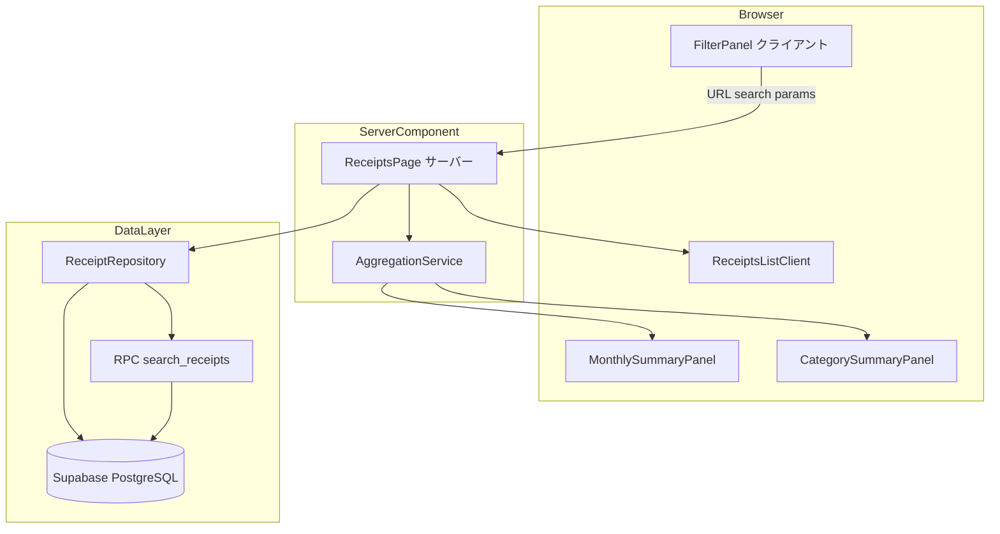
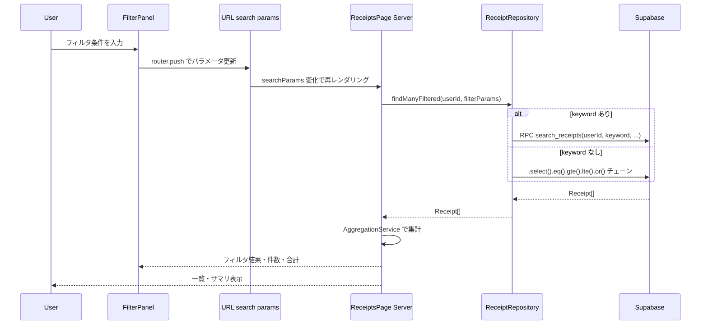

# 技術設計書 — receipt-search-filter

## Overview

本機能は、slipify に蓄積されたレシートデータを検索・フィルタ・集計できるようにする拡張機能である。個人・小規模事業者が経費精算・確定申告において「特定期間の特定科目のレシートを素早く抽出しCSVに落とす」というユースケースを実現する。

既存の `ReceiptsPage`（Server Component）と `ReceiptRepository` に対して最小限の変更を加え、Next.js App Router の URL search params パターンに従ってフィルタ状態を管理する。集計（月別・科目別）はフィルタ済みレシートから JavaScript で計算し、追加のDBクエリを発生させない設計とする。

**Users**: ログイン済みの個人・小規模事業者ユーザーが、レシート一覧ページから直接フィルタ・集計機能を利用する。

**Impact**: 既存の `app/receipts/page.tsx`・`ReceiptRepository.findMany` を拡張する。新規 DB マイグレーション（RPC 関数・インデックス）が必要。

### Goals

- 日付範囲・店名/品目名・勘定科目によるサーバーサイドフィルタリング
- フィルタ後データからの月別・科目別集計表示
- フィルタ状態の URL search params 管理（ブックマーク・共有対応）
- 既存 CSV エクスポート UI とのシームレスな連携

### Non-Goals

- 全文検索エンジン（Elasticsearch 等）の導入
- レシート横断の高度な分析・グラフ可視化（将来の Phase 3）
- 管理者向けの全ユーザー集計
- リアルタイム更新（WebSocket 等）

---

## Requirements Traceability

| 要件 | 概要 | コンポーネント | インターフェース | フロー |
|------|------|----------------|-----------------|--------|
| 1.1, 1.2 | 店名・品目名 部分一致検索 | ReceiptRepository, FilterPanel | `findManyFiltered`, RPC `search_receipts` | Filter Flow |
| 1.3, 1.4 | 0件メッセージ・クリア | FilterPanel, ReceiptsPage | — | — |
| 2.1–2.5 | 日付範囲フィルタ + クイック選択 | ReceiptRepository, FilterPanel | `findManyFiltered` | Filter Flow |
| 3.1–3.4 | 勘定科目フィルタ（OR条件） | ReceiptRepository, FilterPanel | `findManyFiltered` | — |
| 4.1–4.4 | 複合フィルタ・適用状態表示・リアルタイム更新 | FilterPanel, ReceiptsPage | URL search params | Filter Flow |
| 5.1–5.4 | 月別支出サマリ | AggregationService, MonthlySummaryPanel | `computeMonthlySummary` | — |
| 6.1–6.4 | 科目別支出サマリ | AggregationService, CategorySummaryPanel | `computeCategorySummary` | — |
| 7.1–7.3 | CSVエクスポート連携 | ReceiptsListClient | 既存 CSV エンドポイント | — |

---

## Architecture

### Existing Architecture Analysis

- `app/receipts/page.tsx`（Server Component）が `ReceiptRepository.findMany(userId)` を直接呼び出し、全件を取得する。
- `ReceiptsListClient`（Client Component）がチェックボックス選択・CSVエクスポートを担当。
- `ReceiptRepository` は Supabase クライアントを内部で生成し、`.eq('user_id', userId).order('created_at', { ascending: false })` のみ実行。

拡張方針:
- `findMany` に `ReceiptFilterParams` を追加して Supabase クエリを条件付きで組み立てる。
- テキスト検索（店名＋品目名）は PostgreSQL RPC 関数 `search_receipts` に委譲する。
- 集計は新規 `AggregationService`（純粋関数）が担当し、DBアクセス不要。

### Architecture Pattern & Boundary Map



**Key Decisions**:
- フィルタ状態は URL search params で管理 → Server Component 再レンダリングでサーバー側フィルタを実現
- テキスト検索のみ RPC 関数に分岐。日付・科目フィルタは Supabase JS チェーンで対応
- 集計はフィルタ済みレシート配列に対する純粋関数計算（追加 DB クエリなし）

### Technology Stack

| Layer | 技術 / バージョン | 本機能での役割 | Notes |
|-------|-----------------|--------------|-------|
| Frontend | Next.js 15 App Router | FilterPanel（Client）+ ReceiptsPage（Server） | 既存スタック |
| State | URL search params (`useSearchParams`, `useRouter`) | フィルタ条件の永続化 | React state は使わない |
| Backend | Next.js Route Handler（既存） | GET /api/receipts 拡張（フィルタ対応） | CSV連携用 |
| Data | Supabase JS + PostgreSQL RPC | フィルタクエリ・全文横断検索 | 新規 RPC 関数・インデックスを追加 |

---

## System Flows

### Filter Flow（URL search params → サーバーフィルタ）



フロー上の決定事項:
- フィルタ変更のたびにサーバーレンダリングが走る（デバウンスは FilterPanel 側で 300ms 実施）
- 結果が0件でも正常レスポンス（空配列）。0件メッセージは ReceiptsPage が表示

---

## Components and Interfaces

### Component Summary

| Component | Layer | Intent | 要件カバレッジ | Key Dependencies |
|-----------|-------|--------|--------------|-----------------|
| ReceiptFilterParams | Type | フィルタ条件の型定義 | 1–4 全般 | — |
| ReceiptRepository (拡張) | Data | フィルタ付きクエリ実行 | 1.1, 2.1–2.4, 3.1–3.3 | Supabase P0 |
| AggregationService | Lib | 月別・科目別集計 | 5.1–5.4, 6.1–6.4 | — |
| FilterPanel | UI Client | フィルタ入力UI・URL管理 | 1.1–1.4, 2.1–2.5, 3.1–3.4, 4.1–4.4 | useSearchParams P0 |
| MonthlySummaryPanel | UI Client | 月別サマリ表示 | 5.1–5.4 | FilterPanel P1 |
| CategorySummaryPanel | UI Client | 科目別サマリ表示 | 6.1–6.4 | FilterPanel P1 |
| ReceiptsPage (拡張) | Server | searchParams 受け取り・データ取得・集計 | 全般 | ReceiptRepository P0, AggregationService P0 |
| ReceiptsListClient (拡張) | UI Client | フィルタ後 ID での CSV エクスポート | 7.1–7.3 | GET /api/exports/csv P0 |

---

### Data Layer

#### ReceiptFilterParams（型定義）

| Field | Detail |
|-------|--------|
| Intent | フィルタ条件を一括で表現する値オブジェクト |
| Requirements | 1.1, 2.1–2.4, 3.1–3.3 |

**Service Interface**

```typescript
interface ReceiptFilterParams {
  keyword?: string        // 店名・品目名 部分一致（大小文字区別なし）
  startDate?: string      // ISO 8601 日付 (YYYY-MM-DD)
  endDate?: string        // ISO 8601 日付 (YYYY-MM-DD)
  categories?: string[]   // 勘定科目コード一覧（OR 条件）
}
```

- Preconditions: `startDate <= endDate`（バリデーションは FilterPanel 側で実施）
- Postconditions: なし（値オブジェクト）

---

#### ReceiptRepository（拡張）

| Field | Detail |
|-------|--------|
| Intent | フィルタ条件を受け取り Supabase クエリを構築してレシート一覧を返す |
| Requirements | 1.1, 1.2, 2.1–2.4, 3.1–3.3 |

**Responsibilities & Constraints**
- `findMany(userId)` の後方互換を維持しつつ、`findManyFiltered(userId, filter)` を追加する
- keyword が指定された場合は `search_receipts` RPC に委譲し、それ以外は Supabase JS チェーンで対応
- カテゴリフィルタは `account_category` OR `ai_account_category` の OR 条件で適用
- 全操作で `user_id` フィルタを明示的に付与（RLS との多重防御）

**Dependencies**
- Inbound: ReceiptsPage — フィルタ付き一覧取得 (P0)
- Outbound: Supabase JS — .ilike / .gte / .lte / .or / .rpc (P0)

**Contracts**: Service [x]

**Service Interface**

```typescript
interface ReceiptRepository {
  findMany(userId: string): Promise<Receipt[]>
  findManyFiltered(userId: string, filter: ReceiptFilterParams): Promise<Receipt[]>
  // 既存メソッドは省略
}
```

**PostgreSQL RPC（DB マイグレーション）**

```sql
-- 新規作成: 店名 + 品目名の横断検索
CREATE OR REPLACE FUNCTION search_receipts(
  p_user_id UUID,
  p_keyword  TEXT,
  p_start_date DATE DEFAULT NULL,
  p_end_date   DATE DEFAULT NULL
)
RETURNS SETOF receipts
LANGUAGE sql
SECURITY DEFINER
AS $$
  SELECT DISTINCT r.*
  FROM receipts r
  LEFT JOIN line_items li ON li.receipt_id = r.id
  WHERE r.user_id = p_user_id
    AND (
      r.store_name ILIKE '%' || p_keyword || '%'
      OR li.name   ILIKE '%' || p_keyword || '%'
    )
    AND (p_start_date IS NULL OR r.receipt_date >= p_start_date)
    AND (p_end_date   IS NULL OR r.receipt_date <= p_end_date)
  ORDER BY r.created_at DESC;
$$;
```

**インデックス（DB マイグレーション）**

```sql
-- 日付範囲フィルタのパフォーマンス向上
CREATE INDEX IF NOT EXISTS idx_receipts_user_receipt_date
  ON receipts (user_id, receipt_date DESC);
```

**Implementation Notes**
- `findManyFiltered` は keyword がある場合のみ RPC 呼び出し。ない場合は既存 `.from('receipts').select('*')` チェーンで対応
- カテゴリの OR 条件: `.or(`account_category.in.(${cats}),ai_account_category.in.(${cats})`)`
- RPC のカテゴリフィルタは keyword 有の場合にクライアントサイドでポストフィルタする（MVP簡略化）

---

### Lib Layer

#### AggregationService

| Field | Detail |
|-------|--------|
| Intent | フィルタ済みレシート配列から月別・科目別集計を計算する純粋関数群 |
| Requirements | 5.1–5.4, 6.1–6.4 |

**Contracts**: Service [x]

**Service Interface**

```typescript
interface MonthlySummary {
  month: string        // "YYYY-MM"
  count: number
  totalAmount: number
}

interface CategorySummary {
  category: string
  count: number
  totalAmount: number
  percentage: number   // 全体合計に対する割合 (0–100)
}

interface AggregationResult {
  monthlySummaries: MonthlySummary[]   // 降順（新しい月が先）
  categorySummaries: CategorySummary[] // totalAmount 降順
}

function computeAggregation(receipts: Receipt[]): AggregationResult
```

- Preconditions: `receipts` は有効な Receipt 配列（空配列も許容）
- Postconditions: `categorySummaries` の `percentage` の合計は 100（端数は最大値項目に吸収）
- Invariants: DB アクセス不要。副作用なし。

**Implementation Notes**
- 勘定科目は `accountCategory`（確定値）が存在する場合はそれを、ない場合は `aiAccountCategory`（AI予測）を使用
- `percentage` は `Math.round()` で整数化し、合計が 100 になるよう調整

---

### UI Layer

#### FilterPanel

| Field | Detail |
|-------|--------|
| Intent | フィルタ条件の入力UIを提供し、URL search params でフィルタ状態を管理するクライアントコンポーネント |
| Requirements | 1.1–1.4, 2.1–2.5, 3.1–3.4, 4.1–4.4 |

**Responsibilities & Constraints**
- `useSearchParams` + `useRouter` で URL を更新（直接の React state は持たない）
- テキスト入力は 300ms デバウンスで URL 更新（過剰なサーバー再レンダリングを防ぐ）
- 開始日 > 終了日の場合はフォームレベルでバリデーションエラーを表示し、URL は更新しない
- クイック日付選択（今月・先月・直近3ヶ月）は開始日・終了日をセットで設定

**Contracts**: State [x]

**State Management**

```typescript
// URL search params のキー定義
type FilterSearchParams = {
  keyword?: string      // "keyword"
  startDate?: string    // "startDate"
  endDate?: string      // "endDate"
  categories?: string   // "categories" カンマ区切り "消耗品費,交際費"
}
```

- 状態モデル: URL search params を Single Source of Truth とし、`useSearchParams` で読み取る
- 永続化: URL に直接反映されるためブラウザ履歴・ブックマーク対応
- 並行性: デバウンスにより過剰な URL 更新を防止

**Props Interface**

```typescript
interface FilterPanelProps {
  availableCategories: string[]  // 固定科目 + カスタム科目の一覧
  filteredCount: number          // フィルタ後件数（Server Component から受け取る）
  filteredTotal: number          // フィルタ後合計金額
}
```

**Implementation Notes**
- 適用中フィルタはバッジ形式で表示。各バッジに個別クリアボタン付き（要件 4.2）
- 「すべてクリア」ボタンで全パラメータを URL から除去（要件 4.3）

---

#### MonthlySummaryPanel / CategorySummaryPanel

| Component | Layer | Intent |
|-----------|-------|--------|
| MonthlySummaryPanel | UI Client | 月別集計を降順で表示。クリックで日付フィルタを適用 |
| CategorySummaryPanel | UI Client | 科目別集計を金額降順・割合付きで表示。クリックで科目フィルタを適用 |

**Props（共通パターン）**

```typescript
interface MonthlySummaryPanelProps {
  summaries: MonthlySummary[]
}

interface CategorySummaryPanelProps {
  summaries: CategorySummary[]
}
```

両コンポーネントはクリック時に `useRouter` で URL search params を更新し、FilterPanel と同様のフィルタ適用ロジックを使う。プレゼンテーション専用のため新しい境界を持たない（summary-only として扱う）。

---

### API Layer

#### GET /api/receipts（拡張）

| Field | Detail |
|-------|--------|
| Intent | 既存 GET /api/receipts にフィルタ query params を追加し、CSV エクスポート連携時のフィルタ後 ID 取得を可能にする |
| Requirements | 7.1, 7.2 |

**API Contract**

| Method | Endpoint | Request | Response | Errors |
|--------|----------|---------|----------|--------|
| GET | /api/receipts | `?keyword=&startDate=&endDate=&categories=` | `{ receipts, total, totalAmount }` | 401, 500 |

- `categories`: カンマ区切り文字列 `"消耗品費,交際費"`
- CSV エクスポート時、`ReceiptsListClient` がフィルタ後 ID を `ReceiptsPage` から props で受け取ることで `/api/exports/csv` への `receiptIds` パラメータを構築する

**Implementation Notes**
- ファイル名生成: フィルタに日付範囲がある場合 `slipify_receipts_20260101_20260331.csv`、ない場合 `slipify_receipts_20260331.csv`（要件 7.2）
- エクスポート対象 0 件時: 既存エラーハンドリングをそのまま利用（要件 7.3）

---

## Data Models

### Domain Model

既存の `Receipt`・`LineItem` ドメインモデルは変更なし。本機能が追加するのは以下の読み取り専用モデルのみ。

```typescript
// 集計専用の Value Object（DB保存不要）
interface MonthlySummary {
  month: string      // "YYYY-MM"
  count: number
  totalAmount: number
}

interface CategorySummary {
  category: string
  count: number
  totalAmount: number
  percentage: number
}
```

### Physical Data Model（変更部分のみ）

**新規 DB マイグレーション**:
1. PostgreSQL RPC 関数 `search_receipts`（前述）
2. インデックス `idx_receipts_user_receipt_date`（前述）
3. RLS: `search_receipts` は `SECURITY DEFINER` で動作するため、関数内で `user_id` フィルタを必ず付与する（多重防御）

既存テーブルスキーマへの変更はなし。

---

## Error Handling

### Error Strategy

- **バリデーションエラー（日付）**: FilterPanel でクライアント側チェック → フォームレベルエラーメッセージ表示。URL は更新しない。
- **0件結果**: 正常ケースとして扱い、ReceiptsPage が「該当するレシートが見つかりませんでした」を表示（要件 1.3）。
- **DB エラー**: ReceiptRepository が throw した例外は ReceiptsPage で catch し、Error Boundary または Next.js の `error.tsx` でハンドル。

### Error Categories and Responses

| カテゴリ | 条件 | レスポンス |
|---------|------|-----------|
| User Error (400) | 日付バリデーション失敗 | FilterPanel のフォームエラー表示 |
| 0件 (正常) | フィルタ後レシートなし | 「該当なし」メッセージ |
| System Error (500) | Supabase クエリ失敗 | error.tsx によるエラーページ |
| Export Error | フィルタ後 0 件でエクスポート | 既存の「エクスポート対象がありません」メッセージ |

---

## Testing Strategy

### Unit Tests

- `AggregationService.computeAggregation`:
  - 空配列 → 空集計を返す
  - 複数月にまたがるレシート → 月別降順で集計
  - `accountCategory` がある場合は `aiAccountCategory` を使わない
  - `percentage` の合計が 100 になる（端数調整）

### Integration Tests

- `ReceiptRepository.findManyFiltered`:
  - keyword のみ指定 → RPC 呼び出しで store_name / item name 一致
  - 日付範囲 + カテゴリ → 複合フィルタが正しく機能する
  - 空フィルタ → `findMany` と同等の結果

### E2E Tests

- フィルタ入力 → URL params 更新 → 一覧が絞り込まれる（FilterPanel + ReceiptsPage 連携）
- 月別サマリクリック → 日付フィルタが自動適用される
- フィルタ適用中に CSV エクスポート → フィルタ後 ID でダウンロード

---

## Security Considerations

- RPC 関数 `search_receipts` は `SECURITY DEFINER` で実行されるため、関数内の `user_id = p_user_id` フィルタが必須。RLS の迂回を防ぐため、関数内での user_id 検証を必ず実装する。
- URL search params 経由でユーザー入力が Supabase クエリに渡る。Supabase JS の parameterized query を使用しており SQL インジェクションは防止済み。

## Performance & Scalability

- テキスト検索（ILIKE）は B-Tree インデックスが効かないため、レシート数が 10,000 件を超えた場合は PostgreSQL Full-Text Search（`tsvector` + `GIN` インデックス）への移行を検討する。
- 日付範囲フィルタは `idx_receipts_user_receipt_date` 複合インデックスで対応。
- FilterPanel のデバウンス（300ms）で不要なサーバー再レンダリングを抑制する。
