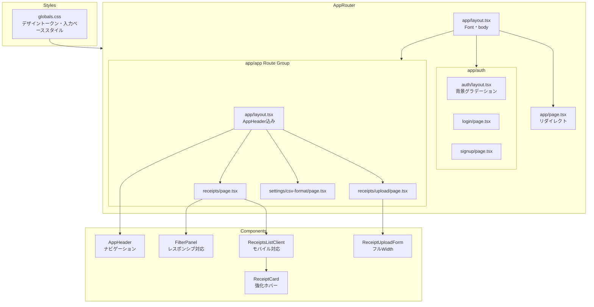
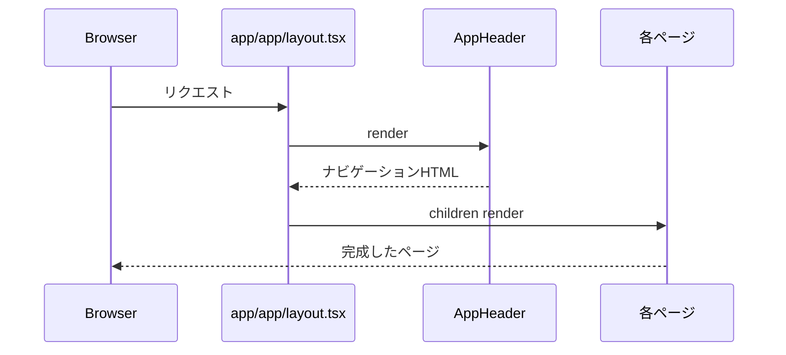

# 技術設計書 — ui-redesign

## Overview

本フィーチャーは、Slipifyフロントエンドのビジュアルデザインと操作性を刷新する。現在のUIは入力フィールドの文字色が不明瞭で視認性が低く、全体配色が単調で、モバイルデバイスでのレイアウト崩れが生じている。

**Purpose**: 入力視認性・ブランドデザイン・モバイル対応を改善し、ユーザーが快適に操作できるUIを提供する。
**Users**: Slipifyのすべてのエンドユーザー（個人・小規模事業者）がレシートアップロード・一覧閲覧・CSV出力などの主要ワークフローで利用する。
**Impact**: バックエンドAPIやデータモデルの変更なし。変更対象は `app/` と `components/` のUIレイヤーのみ。

### Goals

- 入力フィールドの文字色を `text-gray-900` で統一し、WCAG AA 基準（コントラスト比 ≥ 4.5:1）を満たす
- Route Group `(app)` を用いた認証済み共通レイアウト（ナビヘッダー）を導入する
- 375px 幅（iPhone SE）以上で横スクロールなしのレスポンシブレイアウトを実現する
- Tailwind CSS 標準トークンを活用し、全ページで統一されたカラーパレットを適用する

### Non-Goals

- ダークモード対応（将来仕様として検討）
- バックエンドAPI・データモデルの変更
- 新規機能（検索・フィルタ・CSV出力などの機能拡張）
- `tailwind.config.ts` へのカスタムカラートークン定義（将来スケール時に検討）

---

## Requirements Traceability

| 要件 | 概要 | 対応コンポーネント | インターフェース | フロー |
|------|------|-----------------|--------------|------|
| 1.1–1.5 | 入力フィールド視認性 | `BaseInputStyle`, 全フォームコンポーネント | `BaseInputProps` | — |
| 2.1–2.4 | カラーテーマ統一 | `globals.css`, 全コンポーネント | CSS カスタムプロパティ | — |
| 3.1–3.5 | レイアウト・背景 | `AppHeader`, `AppLayout` (`(app)/layout.tsx`) | `AppHeaderProps` | — |
| 4.1–4.4 | 認証画面デザイン | `(auth)/layout.tsx`, `LoginPage`, `SignupPage` | — | — |
| 5.1–5.5 | フォームコンポーネント統一 | `BaseInputStyle`, `BasePrimaryButton`, 全フォーム | `BaseButtonProps` | — |
| 6.1–6.4 | レシートカード・一覧 | `ReceiptCard`, `ReceiptsListClient` | `ReceiptCardProps` | — |
| 7.1–7.7 | モバイルレスポンシブ | 全レイアウト・パネルコンポーネント | — | — |

---

## Architecture

### Existing Architecture Analysis

- `app/layout.tsx`: ルートレイアウト。`<body>` のみで、ナビゲーション等なし。
- `app/(auth)/layout.tsx`: 認証ページ専用。`bg-gray-50` の中央寄せ。フォームカードは `bg-white shadow-md`。
- 各認証済みページ（`receipts/page.tsx`, `upload/page.tsx` 等）が個別に `mx-auto max-w-2xl px-4 py-8` を持つ。共通レイアウト未使用。
- `LogoutButton` は存在するがどのページにも組み込まれていない。
- 入力要素に Tailwind の `text-{color}` クラスが未指定。`globals.css` の CSS カスタムプロパティ経由での文字色継承がブラウザ（特に Safari/iOS WebKit）で不安定。

### Architecture Pattern & Boundary Map



**Architecture Integration**:
- **Selected pattern**: Route Group `(app)/layout.tsx` — Next.js App Router の推奨パターン。URLに影響なく認証済みページを束ねる。（詳細は `research.md` 参照）
- **Domain boundaries**: auth フロー（`(auth)/`）と認証済みアプリ（`(app)/`）のレイアウト責務を Route Group で完全分離。
- **Existing patterns preserved**: `(auth)/layout.tsx` の構造を継承し、背景スタイルのみ強化。
- **New components**: `AppHeader`（ナビゲーションヘッダー）1件のみ追加。
- **Steering compliance**: `components/` 配下に UIコンポーネントを配置、`app/` 配下にルーティングという既存ルールに準拠。

### Technology Stack

| レイヤー | 採用技術 | 役割 | 備考 |
|---------|---------|------|------|
| UI Framework | Next.js 15 App Router | ルーティング・Route Group | 変更なし |
| スタイリング | Tailwind CSS | ユーティリティクラス、レスポンシブ接頭辞 | `indigo-600` をプライマリに統一 |
| デザイントークン | CSS Custom Properties (`globals.css`) | 入力ベーススタイル | `@layer base` で定義 |
| 言語 | TypeScript strict | 型安全なprops定義 | `any` 禁止 |

---

## System Flows

### 認証済みページ描画フロー



---

## Components and Interfaces

### コンポーネントサマリ

| コンポーネント | レイヤー | Intent | 要件カバレッジ | 主要依存 | コントラクト |
|-------------|--------|--------|------------|--------|-----------|
| `AppHeader` | UI / Layout | グローバルナビゲーションヘッダー | 3.2, 7.3 | `LogoutButton` (P0) | State |
| `AppLayout` (`(app)/layout.tsx`) | Layout | 認証済みページの共通シェル | 3.1, 3.2 | `AppHeader` (P0) | — |
| `BaseInputStyle` | Design Token | 入力要素の統一クラス定義（CSS + ユーティリティ） | 1.1–1.5, 5.2 | `globals.css` (P0) | — |
| `BasePrimaryButton` | Design Token | プライマリボタンの統一クラス定義 | 5.1, 5.3, 5.4 | — | — |
| `(auth)/layout.tsx` | Layout | 認証ページ背景・カード配置 | 4.1, 4.2 | — | — |
| `ReceiptCard` | UI / Feature | レシートカード強化（ホバー） | 6.1–6.3 | `Receipt` 型 (P0) | — |
| `ReceiptsListClient` | UI / Feature | 一覧・CSV操作モバイル対応 | 6.4, 7.1–7.2 | `Receipt[]`, `ExportTemplate[]` (P0) | State |
| `FilterPanel` | UI / Feature | フィルターパネルモバイル対応 | 7.6, 1.3 | `useRouter` (P0) | State |
| `ReceiptUploadForm` | UI / Feature | アップロードフォームモバイル対応 | 7.5 | `fetch` (P0) | State |

---

### Layout

#### AppHeader

| フィールド | 詳細 |
|---------|------|
| Intent | 全認証済みページに表示するナビゲーションヘッダー |
| Requirements | 3.2, 7.3 |

**Responsibilities & Constraints**
- Slipify ロゴ/アプリ名をリンク（`/receipts`）として表示する
- `LogoutButton` を右側に表示する
- モバイル（375px〜）でもロゴ・ログアウトボタンが44px以上のタップターゲットを確保する

**Dependencies**
- Inbound: `(app)/layout.tsx` — レンダリング呼び出し（P0）
- Outbound: `LogoutButton` — ログアウトアクション（P0）

**Contracts**: State [x]

##### State Management
- 状態なし（純粋なプレゼンテーションコンポーネント）
- `LogoutButton` は内部で Server Action を呼び出す

**Implementation Notes**
- `app/(app)/layout.tsx` から `<AppHeader />` を `<main>` の前に配置する
- 背景: `bg-white border-b border-gray-200`、高さ: `h-14` (min-h)
- ロゴエリア: `text-indigo-600 font-bold text-lg`
- モバイルでは `px-4`、デスクトップでは `px-6` のパディング

---

#### AppLayout（`app/(app)/layout.tsx`）

| フィールド | 詳細 |
|---------|------|
| Intent | 認証済みページの共通レイアウトシェル（ヘッダー + コンテンツエリア） |
| Requirements | 3.1, 3.2, 3.5 |

**Responsibilities & Constraints**
- `bg-gray-50` のページ背景を全認証済みページに適用する
- `AppHeader` を全ページ上部に配置する
- `<main>` に `min-h-screen` を付与し、コンテンツが短い場合もフッターが浮かない

**Implementation Notes**
- ファイル移動: `app/receipts/`, `app/settings/` → `app/(app)/receipts/`, `app/(app)/settings/`（URLは変化しない）
- `app/page.tsx` は `(app)` 外に残し `/receipts` への redirect を実施

---

### Design Tokens

#### BaseInputStyle

| フィールド | 詳細 |
|---------|------|
| Intent | 全入力要素に適用する統一Tailwindクラス文字列を定義 |
| Requirements | 1.1–1.5, 5.2 |

**Responsibilities & Constraints**
- TypeScript の定数として `const INPUT_CLASS` をエクスポートし、各コンポーネントで `className={INPUT_CLASS}` として参照する
- `globals.css` の `@layer base` に `input, select, textarea` のベーススタイルを定義し、CSS カスタムプロパティの継承問題を根本解決する

**Contracts**: State [ ] / API [ ] / Event [ ] / Batch [ ] / State [ ]

##### Service Interface

```typescript
// lib/styles/form.ts
export const INPUT_CLASS =
  'block w-full rounded-md border border-gray-300 px-3 py-2 text-sm text-gray-900 placeholder:text-gray-400 focus:border-indigo-500 focus:outline-none focus:ring-1 focus:ring-indigo-500 disabled:opacity-50 disabled:cursor-not-allowed' as const

export const PRIMARY_BUTTON_CLASS =
  'rounded-md bg-indigo-600 px-4 py-2 text-sm font-medium text-white hover:bg-indigo-700 focus:outline-none focus:ring-2 focus:ring-indigo-500 focus:ring-offset-2 disabled:opacity-50 disabled:cursor-not-allowed' as const

export const SECONDARY_BUTTON_CLASS =
  'rounded-md border border-gray-300 bg-white px-4 py-2 text-sm font-medium text-gray-700 hover:bg-gray-50 focus:outline-none focus:ring-2 focus:ring-indigo-500 focus:ring-offset-2' as const

export const LABEL_CLASS =
  'block text-sm font-medium text-gray-700' as const

export const CARD_CLASS =
  'rounded-lg border border-gray-200 bg-white p-4 shadow-sm' as const
```

**Implementation Notes**
- `globals.css` の `@layer base` に以下を追加:
  ```css
  input, select, textarea {
    color: theme('colors.gray.900');
  }
  input::placeholder, textarea::placeholder {
    color: theme('colors.gray.400');
  }
  ```
- 各コンポーネントでは `className={INPUT_CLASS}` または `cn(INPUT_CLASS, '追加クラス')` のように使用する
- `cn()` ユーティリティが未導入の場合は template literal concatenation でよい

---

### UI / Feature

#### ReceiptCard

| フィールド | 詳細 |
|---------|------|
| Intent | レシートカードのビジュアル改善（タイポグラフィ階層・ホバーエフェクト） |
| Requirements | 6.1, 6.2, 6.3 |

**Responsibilities & Constraints**
- 店名（`font-semibold text-gray-900`）・金額（`font-bold text-indigo-700`）・日付（`text-sm text-gray-500`）のタイポグラフィ階層を確立する
- `hover:shadow-md hover:border-indigo-200 transition-all` でインタラクティビティを示す

**Contracts**: State [ ]

**Implementation Notes**
- 現在の `hover:shadow-md` に `hover:border-indigo-200 transition-all duration-150` を追加
- 金額テキストに `text-indigo-700 font-bold` を適用してブランドカラーと紐付ける
- カテゴリバッジ: `bg-indigo-50 text-indigo-700` に統一（要件 2.4 カラー統一）

---

#### ReceiptsListClient

| フィールド | 詳細 |
|---------|------|
| Intent | レシート一覧のモバイルレスポンシブ対応・デザイン統一 |
| Requirements | 6.4, 7.1, 7.2, 5.1 |

**Responsibilities & Constraints**
- 空状態メッセージを視覚的に整えた `EmptyState` ブロックで表示する（要件 6.4）
- CSVエクスポートパネルをモバイルで `flex-col` に変更する（要件 7.2）
- CSVエクスポートボタンを `bg-emerald-600` に統一（プライマリ `indigo` との色区別）

**Contracts**: State [x]

**Implementation Notes**
- CSVパネル: `flex flex-col sm:flex-row sm:flex-wrap gap-3`
- CSVボタン: `PRIMARY_BUTTON_CLASS` ベースで `bg-emerald-600 hover:bg-emerald-700 focus:ring-emerald-500` に上書き
- `select` 要素に `INPUT_CLASS` を適用（幅は `w-full sm:w-auto`）

---

#### FilterPanel

| フィールド | 詳細 |
|---------|------|
| Intent | フィルターパネルのモバイルレスポンシブ対応・入力視認性改善 |
| Requirements | 1.3, 7.1, 7.6 |

**Responsibilities & Constraints**
- テキスト検索 `<input>` に `INPUT_CLASS` を適用する
- 日付範囲入力を `flex flex-col sm:flex-row gap-2` でモバイル縦積みにする
- クイック日付ボタンを `flex flex-wrap gap-1.5` で折り返し可能にする

**Contracts**: State [x]

**Implementation Notes**
- 日付入力ラッパー: `flex flex-col sm:flex-row gap-2` に変更
- 区切り `〜` テキスト: `hidden sm:block` で小画面では非表示
- 勘定科目タグ: モバイルで縦スクロールできるよう `max-h-32 overflow-y-auto sm:max-h-none` を追加

---

#### ReceiptUploadForm

| フィールド | 詳細 |
|---------|------|
| Intent | アップロードフォームのモバイルフルWidth対応 |
| Requirements | 7.5, 5.1 |

**Responsibilities & Constraints**
- 「解析を開始」ボタンを `w-full` で全幅にする（現状既に `w-full` のため維持確認）
- ファイル入力が `w-full` であることを確認する

**Implementation Notes**
- 現状の `w-full` は維持。`PRIMARY_BUTTON_CLASS` で `bg-indigo-600` に統一する。

---

### Pages

#### `(auth)/layout.tsx` — 認証ページ背景強化

**Requirements**: 4.1, 3.5

**Implementation Notes**
- 現在: `bg-gray-50` → 変更後: `bg-gradient-to-br from-indigo-50 to-slate-100` など淡いグラデーション
- カード最大幅 `max-w-md` は維持

#### `LoginPage` / `SignupPage`

**Requirements**: 4.2, 4.3, 4.4, 1.3, 1.4

**Implementation Notes**
- フォームカード上部にアプリ名 `Slipify` を `text-2xl font-bold text-indigo-600` で表示
- `<input>` に `INPUT_CLASS` を適用（`text-gray-900` 明示が最重要変更点）
- ボタンに `PRIMARY_BUTTON_CLASS` を適用（`bg-indigo-600`）

---

## Data Models

本フィーチャーはUIレイヤーのみの変更。データモデル変更なし。

**新規ファイル**: `lib/styles/form.ts`（Tailwindクラス定数エクスポート）

```typescript
// 型定義：クラス文字列は const string として型推論される
export type TailwindClass = string
```

---

## Error Handling

### Error Categories and Responses

**UIエラー（既存維持）**
- フォームバリデーションエラー: 既存の `text-red-600` / `bg-red-50` スタイルを維持
- アップロードエラー: 既存の `role="alert"` 付きエラーブロックを維持

**デザイン変更による副作用リスク**
- `INPUT_CLASS` 適用後のフォーカスリング衝突: `focus:outline-none` が明示されているため問題なし
- `(app)/layout.tsx` 導入後のルート不整合: ページ移動後に全ルートの動作確認が必要（`research.md` Risks 参照）

---

## Testing Strategy

### Unit Tests
- `lib/styles/form.ts`: `INPUT_CLASS` / `PRIMARY_BUTTON_CLASS` の文字列が期待するTailwindクラスを含むことを確認（snapshot テスト）

### Integration / UI Tests（Vitest + Testing Library）
1. `LoginPage`: 入力フィールドに `text-gray-900` クラスが付与されていることを確認
2. `FilterPanel`: viewport 375px でフィルターパネルが横スクロールなしにレンダリングされること
3. `AppHeader`: 全認証済みページで `AppHeader` が表示されること
4. `ReceiptsListClient`: 空状態のとき「まだ登録されていません」メッセージが表示されること

### Visual Regression（推奨）
- `receipts/page.tsx` のデスクトップ（1280px）・モバイル（375px）スナップショット比較

---

## Performance & Scalability

- 変更は CSS クラス文字列の整理のみ。バンドルサイズへの影響は無視できるレベル。
- 新規フォント導入は本スコープ外とする（既存 Arial を維持）。
- `globals.css` の `@layer base` 追加による CSS 出力増加は最小限（数行）。

---

## Migration Strategy

1. `lib/styles/form.ts` を新規作成しクラス定数を定義
2. `globals.css` に `@layer base` 入力スタイルを追加
3. `app/(app)/layout.tsx` + `components/app-header.tsx` を新規作成
4. `app/receipts/`, `app/settings/` を `app/(app)/` 配下に移動
5. 全フォームコンポーネントに `INPUT_CLASS` / `PRIMARY_BUTTON_CLASS` を適用
6. `(auth)/layout.tsx` 背景・ロゴ追加
7. `ReceiptCard` / `ReceiptsListClient` / `FilterPanel` のモバイルレスポンシブ修正
8. 全ルートの動作確認・スタイル確認

ロールバック戦略: すべての変更は Git コミットで管理。ファイル移動は `git mv` で追跡し、問題発生時は `git revert` で即時復元可能。
